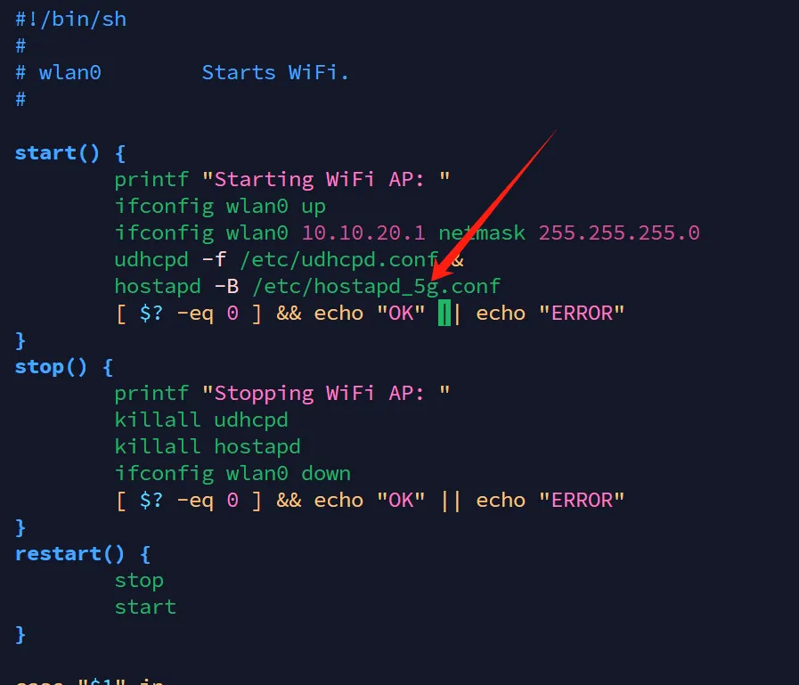

# 原始资料

- 本项目基于 `https://guanglun.github.io/gldrone/gldrone-t113` 做分析 , px4 版本为 `v1.14.2`。

- T113资料：https://guanglun.github.io/gldrone/gldrone-t113
    - https://github.com/guanglun/PX4-Autopilot

- 其他相关视频资料：【年轻人第一款Linux飞控-哔哩哔哩】 https://b23.tv/QJzYvBm
    - https://blog.csdn.net/weixin_42037083?type=blog
    - https://blog.csdn.net/weixin_55944949/article/details/130848009?spm=1001.2014.3001.5502

---

## 设置2.4G

- 热点2.4G/5G切换
    - 进入终端修改脚本vim /etc/init.d/S45wifi_ap


"hostapd"后面添加"_5g"为使用5G热点，不添加为使用2.4G热点
飞控板的热点WIFI：DRONE5G(密码：12345678)

- Linux用户名：root 密码：root
- 串口4为Linux调试串口，波特率115200

---

## 系统相关信息

```bash
# armv7l架构（arm32）,  两核心，112M内存 ， 100M硬盘

root@gldz:~$ cat /etc/os-release
NAME=Buildroot
VERSION=-g14ad2dcb
ID=buildroot
VERSION_ID=2023.02
PRETTY_NAME="Buildroot 2023.02"

root@gldz:~$ uname -a
Linux gldz 6.8.0 #1 SMP Wed Apr 16 18:09:06 CST 2025 armv7l GNU/Linux

root@gldz:~$ df -h
Filesystem                Size      Used Available Use% Mounted on
ubi0:rootfs             100.7M     52.2M     48.5M  52% /
devtmpfs                 47.7M         0     47.7M   0% /dev
tmpfs                    56.2M         0     56.2M   0% /dev/shm
tmpfs                    56.2M     40.0K     56.2M   0% /tmp
tmpfs                    56.2M     28.0K     56.2M   0% /run


```

---

## 控制原理图

```bash
T113(linux) --PWM--> 电机驱动版(stm32)  ----> 电机1
   |                                   |
   |                                   |----> 电机2
   |                                   |
   |                                   |----> 电机3
   |                                   |
   |                                   |----> 电机4
   |
   --- spi/i2c --> IMU/磁罗盘/气压计
   |
   |
   --- 串口转SBUS --> 接收器（手柄遥控器）
   |
   |
   --- wifi --> (ssh,QGC地面站)

```

---

## T113 对PX4 修改分析

### a. 添加 px4_t113 编译对象

- .ci/Jenkinsfile-compile
- .github/workflows/compile_linux.yml

```diff
diff --git a/.ci/Jenkinsfile-compile b/.ci/Jenkinsfile-compile
index 2936194886..1b0d73eb4b 100644
--- a/.ci/Jenkinsfile-compile
+++ b/.ci/Jenkinsfile-compile
@@ -16,7 +16,7 @@ pipeline {
           ]

           def armhf_builds = [
-            target: ["beaglebone_blue_default", "emlid_navio2_default", "px4_raspberrypi_default", "scumaker_pilotpi_default"],
+            target: ["beaglebone_blue_default", "emlid_navio2_default", "px4_raspberrypi_default", "px4_t113_default", "scumaker_pilotpi_default"],
             image: docker_images.armhf,
             archive: false
           ]
diff --git a/.github/workflows/compile_linux.yml b/.github/workflows/compile_linux.yml
index d14b533475..f3ab3bd2c4 100644
--- a/.github/workflows/compile_linux.yml
+++ b/.github/workflows/compile_linux.yml
@@ -18,6 +18,7 @@ jobs:
           beaglebone_blue_default,
           emlid_navio2_default,
           px4_raspberrypi_default,
+          px4_t113_default,
           scumaker_pilotpi_default,
           ]
```

---

### b. 添加 t113 板子 驱动

- `boards/px4/t113/*`
    - pwm_out 实现  `class NavioSysfsPWMOut : public PWMOutBase`
    - i2c/spi 配置

```c++

/// i2c
constexpr px4_i2c_bus_t px4_i2c_buses[I2C_BUS_MAX_BUS_ITEMS] = {
initI2CBusInternal(2),
initI2CBusExternal(0),
initI2CBusExternal(1)};

/// spi
constexpr px4_spi_bus_t px4_spi_buses[SPI_BUS_MAX_BUS_ITEMS] = {
initSPIBus(1,
{initSPIDevice(DRV_ACC_DEVTYPE_BMI088,  0),
initSPIDevice(DRV_GYR_DEVTYPE_BMI088,  1),
}),};

```

- `platforms/posix/cmake/Toolchain-arm-none-linux-gnueabihf.cmake`
    - 对应板子的交叉编译cmake文件
- `posix-configs/t113/*`
    - 添加 t113 px4的相关配置文件
- `src/drivers/auxio/*`
    - 遥控器相关驱动
- `src/modules/battery_status/battery_status.cpp`
    - 电池数据获取修改
- `src/modules/commander/commander_helper.cpp`
    - 屏蔽led灯输出相关代码，应该是没有led运行会报错
- src/modules/mavlink/streams/DISTANCE_SENSOR.hpp
    - 加了打印

---

### c. 运行

```bash
CPU:  11% usr  48% sys   0% nic  40% idle   0% io   0% irq   0% sirq
Load average: 1.82 1.48 0.74 3/102 22781
  PID  PPID USER     STAT   VSZ %VSZ %CPU COMMAND
  158     1 root     S    27036  23%  26% ./bin/px4 -s px4_mc.config -d
```

---

### d. 启动文件 px4_mc.config

- 1. 禁用自动配置，设置自动启动配置为4001（多旋翼）,设置MAV类型为多旋翼
- 2. 启用多IMU支持，设置陀螺仪最大速率400Hz
- 3. 加载多旋翼默认参数 , 配置四旋翼布局，设置每个电机的位置和转向
- 4. 设置PWM信号的禁用值、最小值和最大值
- 5. 启动数据管理和负载监控服务
- 6. 启动各传感器驱动，指定安装旋转方向
- 7. 启动相关模块 （遥控器输入，ekf2，位置控制模块，姿态控制模块，...）
- 8. 启动MAVLink（无人机通信协议）通信，并设置通过wlan0传输数据

```bash
#!/bin/sh
# PX4 commands need the 'px4-' prefix in bash.
# (px4-alias.sh is expected to be in the PATH)
. px4-alias.sh

param select parameters.bson
param import

param set SENS_BOARD_ROT 0

param set SDLOG_MODE 0

# system_power unavailable
param set-default CBRK_SUPPLY_CHK 894281

# Disable safety switch by default
param set-default CBRK_IO_SAFETY 22027

### ---------------

# broadcast to LAN
# always keep current config
param set SYS_AUTOCONFIG 0
# useless but required for parameter completeness

param set SYS_AUTOSTART 4001
param set-default MAV_TYPE 2

### 禁用自动配置，设置自动启动配置为4001（多旋翼）
### 设置MAV类型为多旋翼

# param set MPC_LAND_SPEED 0.8
# param set LNDMC_Z_VEL_MAX 0.8

### ---------------

param set-default EKF2_MULTI_IMU 1
param set-default SENS_IMU_MODE 0
param set-default IMU_GYRO_RATEMAX 400

### 启用多IMU支持，设置陀螺仪最大速率400Hz

### ---------------

. ${R}etc/init.d/rc.mc_defaults
param set-default CA_ROTOR_COUNT 4
param set-default CA_ROTOR0_PX 0.15
param set-default CA_ROTOR0_PY 0.15
param set-default CA_ROTOR1_PX -0.15
param set-default CA_ROTOR1_PY -0.15
param set-default CA_ROTOR2_PX 0.15
param set-default CA_ROTOR2_PY -0.15
param set-default CA_ROTOR2_KM -0.05
param set-default CA_ROTOR3_PX -0.15
param set-default CA_ROTOR3_PY 0.15
param set-default CA_ROTOR3_KM -0.05

### 加载多旋翼默认参数 , 配置四旋翼布局，设置每个电机的位置和转向

### ---------------

param set PWM_MAIN_DIS1 1000
param set PWM_MAIN_DIS2 1000
param set PWM_MAIN_DIS3 1000
param set PWM_MAIN_DIS4 1000

param set PWM_MAIN_MIN1 1001
param set PWM_MAIN_MIN2 1001
param set PWM_MAIN_MIN3 1001
param set PWM_MAIN_MIN4 1001

param set PWM_MAIN_MAX1 2000
param set PWM_MAIN_MAX2 2000
param set PWM_MAIN_MAX3 2000
param set PWM_MAIN_MAX4 2000

### 设置PWM信号的禁用值、最小值和最大值

## ---------------
dataman start

load_mon start

### 启动数据管理和负载监控服务

# battery_status start

#ROTATION_YAW_180

## ---------------

bmi088 -A -R 12 -s start  # 加速度计
bmi088 -G -R 12 -s start  # 陀螺仪

bmp388 -I -a 0x76 -f 400 start  # 气压计
ist8310 -I -R 4 start  # 磁力计

### 启动各传感器驱动，指定安装旋转方向

# Optical flow
# pmw3901 -s start
# vl53l1x -X start

rc_input start -d /dev/ttyS5  # 遥控器输入
rc_update start
manual_control start
sensors start  # 传感器数据处理
navigator start
ekf2 start # 扩展卡尔曼滤波器
land_detector start multicopter
mc_hover_thrust_estimator start
flight_mode_manager start # 飞行模式 manager
mc_pos_control start  # 位置控制
mc_att_control start # 姿态控制
mc_rate_control start #

sleep 1

commander start

###-----------------

mavlink start -n wlan0 -x -u 14556 -r 1000000 -p
#mavlink stream -u 14556 -s ATTITUDE            -r 100
mavlink stream -u 14556 -s DISTANCE_SENSOR     -r 10
#mavlink stream -u 14556 -s LOCAL_POSITION_NED  -r 100
mavlink stream -u 14556 -s OPTICAL_FLOW_RAD    -r 50

### 启动MAVLink通信，通过wlan0传输数据

# mavlink start -d /dev/ttyS2 -b 115200
# linux_pwm_out start
control_allocator start
auxio start

#logger start -t -b 200

mavlink boot_complete

```

---
