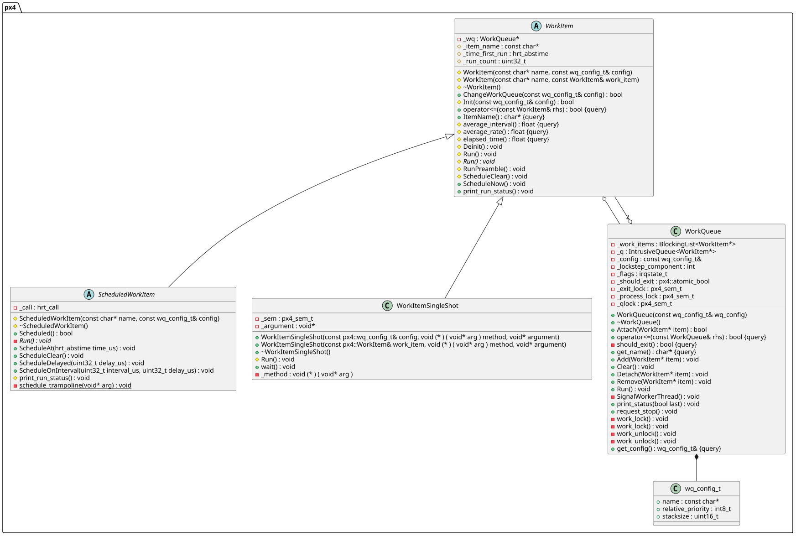

# px4任务队列机制(workqueue)分析

- 源代码路径：`px4/platforms/common/include/px4_platform_common/px4_work_queue`
- 文件：

```bash
.
|-- ScheduledWorkItem.hpp # 可调度 工作事件 单元 ， 通过 ScheduleOnInterval 等方法配置该任务定时触发等调度，使用 hrt_call 注册触发
|-- WorkItem.hpp # 工作事件 单元
|-- WorkItemSingleShot.hpp # 运行特定事件，并等待其退出
|-- WorkQueue.hpp # 处理 多个 workItem 的 queue
`-- WorkQueueManager.hpp # 创建管理多个 WorkQueue ， 并分配线程处理，一个 WorkQueue 对应一个线程
```

## 类图



## WorkQueueManager

- 配置调度，优先级等线程参数
- 并将 `WorkQueue` 分配给指定线程运行(创建一个新线程)

```c++
// ...
// schedule policy FIFO
int ret_setschedpolicy = pthread_attr_setschedpolicy(&attr, SCHED_FIFO);

if (ret_setschedpolicy != 0) {
PX4_ERR("failed to set sched policy SCHED_FIFO (%i)", ret_setschedpolicy);
}

// priority
param.sched_priority = sched_priority;
int ret_setschedparam = pthread_attr_setschedparam(&attr, &param);

if (ret_setschedparam != 0) {
PX4_ERR("setting sched params for %s failed (%i)", wq->name, ret_setschedparam);
}

// create thread
pthread_t thread;
int ret_create = pthread_create(&thread, &attr, WorkQueueRunner, (void *)wq);

```

## WorkQueue 主函数

```c++
void WorkQueue::Run()
{
 while (!should_exit()) {
  // loop as the wait may be interrupted by a signal
  do {} while (px4_sem_wait(&_process_lock) != 0);

  work_lock();

  // process queued work
  while (!_q.empty()) {
   WorkItem *work = _q.pop();

   work_unlock(); // unlock work queue to run (item may requeue itself)
   work->RunPreamble();
   work->Run();
   // Note: after Run() we cannot access work anymore, as it might have been deleted
   work_lock(); // re-lock
  }
// ...
 }
 }
```

---

## ScheduledWorkItem

- 通过 `hrt_call_*` 将触发函数注册到 `hrt_call` 模块
- `hrt_call` 会在指定时间或周期 调用触发函数 `schedule_trampoline`
- 触发函数 会将当前事件重复添加到 绑定的队列 `_wq` 中。 `_wq->Add(this);`
- `_wq->Add` 函数在 事件添加完成 会 触发信号给对应的队列线程； `px4_sem_post(&_process_lock);`
- 队列线程 收到信号后 会将 `WorkItem` 拿出来处理；

```c++
void ScheduledWorkItem::schedule_trampoline(void *arg)
{
 ScheduledWorkItem *dev = static_cast<ScheduledWorkItem *>(arg);
 dev->ScheduleNow();
}

// ...
 inline void ScheduleNow()
 {
  if (_wq != nullptr) {
   _wq->Add(this);
  }
 }

void ScheduledWorkItem::ScheduleDelayed(uint32_t delay_us)
{
 hrt_call_after(&_call, delay_us, (hrt_callout)&ScheduledWorkItem::schedule_trampoline, this);
}

void ScheduledWorkItem::ScheduleOnInterval(uint32_t interval_us, uint32_t delay_us)
{
 hrt_call_every(&_call, delay_us, interval_us, (hrt_callout)&ScheduledWorkItem::schedule_trampoline, this);
}

void ScheduledWorkItem::ScheduleAt(hrt_abstime time_us)
{
 hrt_call_at(&_call, time_us, (hrt_callout)&ScheduledWorkItem::schedule_trampoline, this);
}
```

---

## WorkItemSingleShot

- 目前看到只有 `I2CSPIDriver` 模块使用
- 用来同步等待 `.wait();` 该事件 被异步处理完成；

```c++

I2CSPIDriverInitializing initializer_data{driver_config, instantiate, runtime_instance};
// initialize the object and bus on the work queue thread - this will also probe for the device
px4::WorkItemSingleShot initializer(wq_config, initializer_trampoline, &initializer_data);
initializer.ScheduleNow();
initializer.wait();
```

## 总结

- px4 任务队列机制比较简单易懂，结构也比较清晰
- 由于直接用的系统的调度算法，不另外创建自己的调度器进行调度，比较方便使用
- 缺点很明显，由于 队列 和线程是绑定的，任务分别到哪个队列需要提前规划好
    - 如果一个队列分配的任务过多 ，会造成 任务执行的响应时间变大，延迟严重
