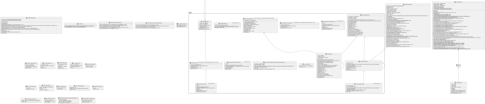

# PX4消息通信机制(uORB)分析

## uORB模块路径

uORB模块位于：`px4/PX4_Autopilot/3rd/px4/platforms/common/uORB`

```bash
.
|-- CMakeLists.txt
|-- Kconfig
|-- ORBSet.hpp                      # 集合容器
|-- Publication.hpp                 # 发布者基类
|-- PublicationMulti.hpp           # 发布者，支持同一ORB_ID的不同实例，便于设备/驱动器的多个实例实现
|-- Subscription.cpp
|-- Subscription.hpp                # 订阅者基类
|-- SubscriptionBlocking.hpp        # 订阅者，支持回调注册(pthread_cond_signal(&_cv))，可以阻塞等待新数据，方法：updateBlocking(T &data, uint32_t timeout_us = 0)
|-- SubscriptionCallback.hpp        # 订阅者，支持回调注册(_work_item->ScheduleNow())，使用SubscriptionCallbackWorkItem
|-- SubscriptionInterval.hpp        # 订阅者，添加时间间隔约束，PX4中主要用于参数更新，无回调，需要主动检查updated()，然后调用copy()获取数据
|-- SubscriptionMultiArray.hpp     # 订阅者，支持同一ORB_ID的多个不同实例订阅
|-- uORB.cpp
|-- uORB.h                          # C接口封装，封装uORB::Manager::get_instance()相关函数
|-- uORBCommon.hpp
|-- uORBCommunicator.hpp            # 远程通信接口
|-- uORBDeviceMaster.cpp
|-- uORBDeviceMaster.hpp
|-- uORBDeviceNode.cpp
|-- uORBDeviceNode.hpp  # 一个 node 管理一个话题 实例(管理queue数据队列，管理SubscriptionCallback，实现发布publish，即通知sub) ,如：/obj/actuator_armed0 ([话题]+[实例id])
|-- uORBManager.cpp
|-- uORBManager.hpp                 # 单例模式，管理节点
|-- uORBManagerUsr.cpp
|-- uORBTopics.h
|-- uORBUtils.cpp
|-- uORBUtils.hpp # 根据话题生成path，该path是唯一，如：/obj/actuator_armed0 ([话题]+[实例id])
```

## 注意事项

- uORB的"topic"概念有点歧义，实际上`/obj/actuator_armed0（[话题名称]+[实例ID]）`才是消息队列的唯一标识，即`PATH`，可以通过`uorb status`命令查看。
- 不要与ROS中的topic概念混淆。

---

## 类图

由于工具对宏的支持不够友好，类关系图仅供参考，大体上是正确的。后续有时间再详细梳理并手动绘制。



---

## Subscription机制

订阅机制负责通知对应的队列进行处理。本节未分析远程通信相关内容。

### SubscriptionCallbackWorkItem

```c++
/// SubscriptionCallbackWorkItem

 void call() override
 {
  // schedule immediately if updated (queue depth or subscription interval)
  if ((_required_updates == 0)
      || (Manager::updates_available(_subscription.get_node(), _subscription.get_last_generation()) >= _required_updates)) {
   if (updated()) {
    _work_item->ScheduleNow();
   }
  }
 }

/// SubscriptionBlocking
 void call() override
 {
  // signal immediately if no interval, otherwise only if interval has elapsed
  if ((_interval_us == 0) || (hrt_elapsed_time(&_last_update) >= _interval_us)) {
   pthread_cond_signal(&_cv);
  }
 }

```

---

## 整体流程

由于时间有限，本节简单分析大体流程，后续有时间再完善。

1. **发布者和订阅者注册**：初始化发布者和订阅者。
2. **发布消息**：`publish(const T&data) --> Manager::orb_publish(get_topic(), _handle, &data) --> DeviceNode::publish --> DeviceNode::write --> for(auto item : _callbacks) {item->call();}`
   - `SubscriptionCallbackWorkItem`：调用`_work_item->ScheduleNow();`
   - `SubscriptionBlocking`：调用`pthread_cond_signal(&_cv);`
3. **接收消息**：
   - `SubscriptionCallbackWorkItem`：工作队列处理工作项中的`run()`实例，组件在`run()`中通过`sub.update(&data);`来使用数据。
   - `SubscriptionBlocking`：在某个线程中阻塞等待新数据`updateBlocking(T &data, uint32_t timeout_us = 0)`。

---

## uORB状态查看

通过`uorb status`命令可以查看当前uORB的状态：

```bash
pxh> uorb status
TOPIC NAME              INST #SUB #Q SIZE PATH
actuator_armed             0    5  1   16 /obj/actuator_armed0
actuator_motors            0    0  1   72 /obj/actuator_motors0
actuator_servos            0    0  1   48 /obj/actuator_servos0
actuator_servos_trim       0    0  1   40 /obj/actuator_servos_trim0
control_allocator_status   0    0  1   56 /obj/control_allocator_status0
control_allocator_status   1    0  1   56 /obj/control_allocator_status1
cpuload                    0    3  1   16 /obj/cpuload0
estimator_selector_status  0    2  1  160 /obj/estimator_selector_status0
event                      0    1 16   40 /obj/event0
failsafe_flags             0    0  1   88 /obj/failsafe_flags0
failure_detector_status    0    1  1   24 /obj/failure_detector_status0
health_report              0    1  1   64 /obj/health_report0
led_control                0    0  8   16 /obj/led_control0
log_message                0    0  4  136 /obj/log_message0
manual_control_setpoint    0    4  1   64 /obj/manual_control_setpoint0
mavlink_log                0    1  8  136 /obj/mavlink_log0
parameter_update           0   22  1   40 /obj/parameter_update0
position_setpoint_triplet  0    3  1  224 /obj/position_setpoint_triplet0
rate_ctrl_status           0    0  1   24 /obj/rate_ctrl_status0
rtl_time_estimate          0    2  1   24 /obj/rtl_time_estimate0
sensor_combined            0    0  1   48 /obj/sensor_combined0
sensor_preflight_mag       0    1  1   16 /obj/sensor_preflight_mag0
sensor_selection           0    6  1   16 /obj/sensor_selection0
sensors_status_imu         0    2  1   96 /obj/sensors_status_imu0
takeoff_status             0    1  1   16 /obj/takeoff_status0
telemetry_status           0    1  1   88 /obj/telemetry_status0
transponder_report         0    2 32   80 /obj/transponder_report0
tune_control               0    0  4   24 /obj/tune_control0
vehicle_acceleration       0    1  1   32 /obj/vehicle_acceleration0
vehicle_air_data           0    5  1   40 /obj/vehicle_air_data0
vehicle_angular_velocity   0    5  1   40 /obj/vehicle_angular_velocity0
vehicle_attitude           0    6  1   56 /obj/vehicle_attitude0
vehicle_command            0    6  8   56 /obj/vehicle_command0
vehicle_control_mode       0    6  1   24 /obj/vehicle_control_mode0
vehicle_global_position    0    7  1   64 /obj/vehicle_global_position0
vehicle_gps_position       0    5  1  128 /obj/vehicle_gps_position0
vehicle_land_detected      0    5  1   24 /obj/vehicle_land_detected0
vehicle_local_position     0   17  1  168 /obj/vehicle_local_position0
vehicle_magnetometer       0    0  1   40 /obj/vehicle_magnetometer0
vehicle_odometry           0    0  1  112 /obj/vehicle_odometry0
vehicle_status             0   18  1   72 /obj/vehicle_status0
wind                       0    2  1   48 /obj/wind0
```

---

## 总结

大致如此，整体的实现方案是常见的消息队列方案，没有特别之处。主要难点在于不同开发者对类的命名可能有所差异，需要先理解各个类的实际作用，再将它们串联起来分析。一些细节之处后续再完善。
