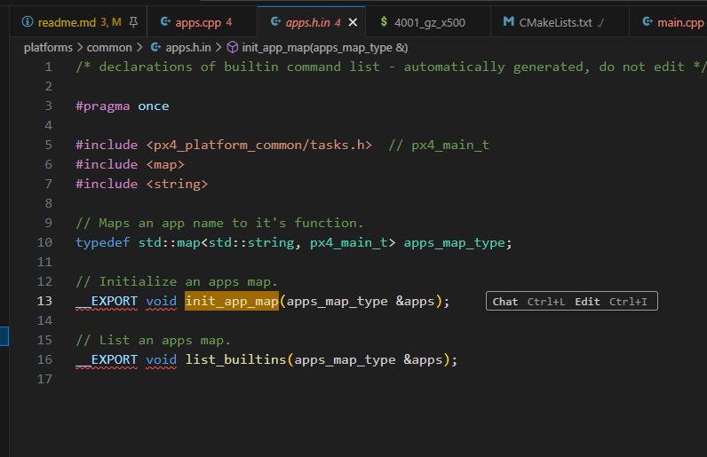
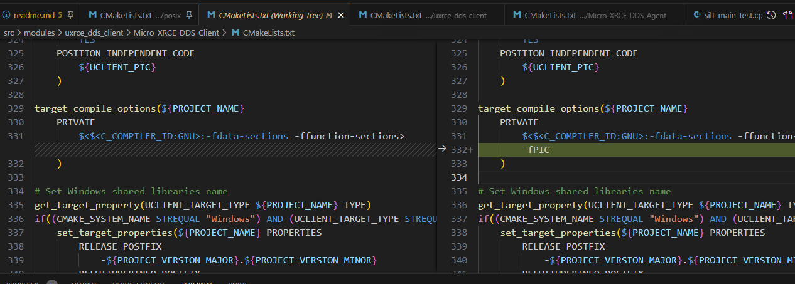

# 仿真环境搭建

ubuntu22.04
humble

##

bash ./PX4-Autopilot/Tools/setup/ubuntu.sh
cd PX4-Autopilot/
make px4_sitl

sudo apt install gpiod
make px4_sitl gz_x500

## test

pxh> commander takeoff

## ros2

pip install --user -U empy==3.3.4 pyros-genmsg setuptools==68.0.0

* setuptools

Setup the Agent

```bash

git clone https://github.com/eProsima/Micro-XRCE-DDS-Agent.git
cd Micro-XRCE-DDS-Agent
mkdir build
cd build
cmake ..
make
sudo make install
sudo ldconfig /usr/local/lib/

## start agent

MicroXRCEAgent udp4 -p 8888
```

### ros2 ws

```bash
mkdir -p ~/ws_sensor_combined/src/
cd ~/ws_sensor_combined/src/

git clone https://github.com/PX4/px4_msgs.git
git clone https://github.com/PX4/px4_ros_com.git

source /opt/ros/humble/setup.bash
colcon build

source install/local_setup.bash

ros2 launch px4_ros_com sensor_combined_listener.launch.py

ros2 run px4_ros_com offboard_control

```

## QGC

```bash

```

extern "C" __EXPORT int auxio_main(int argc, char *argv[])
{
 return G0AUX::main(argc, argv);
}

|
|

T::main(argc, argv) -> start_command_base(...) -> T::task_spawn(argc, argv);

build/linux/platforms/posix/apps.cpp




main() --> px4_daemon::Pxh::process_line(cmd, true); --> Pxh::process_line() --> init_app_map(_apps);

-------

### silt_px4_main

cmake ../../ -DBOARD=px4_sitl

make -j4



cmake ../../ -DBOARD=px4_t113_default -DCONFIG=px4_t113_default

cmake ../../ -DBOARD=px4_t113_default -DCONFIG=px4_t113_default -DCMAKE_TOOLCHAIN_FILE=/opt/tong/ws/gomros2-devicelayer/toolchain/Linux-aarch64.cmake

```bash
export PX4_RUNPATH=/temp/tong/px4/
./bin/px4 -s px4_mc.config
```

```bash
#ubuntu20.04

make px4_sitl gazebo-classic
```

```bash

/bin/sh -c cd /root/ws/PX4-Autopilot/build/px4_sitl_default/src/modules/simulation/simulator_mavlink && /root/ws/PX4-Autopilot/Tools/simulation/gazebo-classic/sitl_run.sh /root/ws/PX4-Autopilot/build/px4_sitl_default/bin/px4 none iris none /root/ws/PX4-Autopilot /root/ws/PX4-Autopilot/build/px4_sitl_default
```

```bash
root@b9ff04fc783c:~# lsof -p 26718
COMMAND   PID USER   FD   TYPE             DEVICE SIZE/OFF       NODE NAME
px4     26718 root  cwd    DIR                8,1     4096    6349397 /root/ws/PX4-Autopilot/build/px4_sitl_default/rootfs
px4     26718 root  rtd    DIR               0,55     4096    5785021 /
px4     26718 root  txt    REG                8,1 54591088    6346158 /root/ws/PX4-Autopilot/build/px4_sitl_default/bin/px4
px4     26718 root  mem    REG               0,55  2029592    5807318 /usr/lib/x86_64-linux-gnu/libc-2.31.so
px4     26718 root  mem    REG               0,55   104984    2379729 /usr/lib/x86_64-linux-gnu/libgcc_s.so.1
px4     26718 root  mem    REG               0,55  1956992    2379814 /usr/lib/x86_64-linux-gnu/libstdc++.so.6.0.28
px4     26718 root  mem    REG               0,55  1369384    5807325 /usr/lib/x86_64-linux-gnu/libm-2.31.so
px4     26718 root  mem    REG               0,55    18848    5807321 /usr/lib/x86_64-linux-gnu/libdl-2.31.so
px4     26718 root  mem    REG               0,55   157224    5807369 /usr/lib/x86_64-linux-gnu/libpthread-2.31.so
px4     26718 root  mem    REG               0,55   191504    5790765 /usr/lib/x86_64-linux-gnu/ld-2.31.so
px4     26718 root    0u   CHR              136,1      0t0          4 /dev/pts/1
px4     26718 root    1u   CHR              136,1      0t0          4 /dev/pts/1
px4     26718 root    2u   CHR              136,1      0t0          4 /dev/pts/1
px4     26718 root    3u  unix 0xffff88ab68498000      0t0    1273611 /tmp/px4-sock-0 type=STREAM
px4     26718 root    4uW  REG               0,55        0    5775873 /tmp/px4_lock-0
px4     26718 root    5r   REG               0,68        0 4026532025 /proc/meminfo
px4     26718 root    6u   REG                8,1  7866640    6346339 /root/ws/PX4-Autopilot/build/px4_sitl_default/rootfs/dataman
px4     26718 root    7u  IPv4            1274567      0t0        TCP localhost:33192->localhost:4560 (ESTABLISHED)
px4     26718 root    9u  IPv4            1276618      0t0        UDP localhost:44166->localhost:8888
px4     26718 root   10u  IPv4            1263510      0t0        UDP *:18570
px4     26718 root   11u  IPv4            1276643      0t0        UDP *:14580
px4     26718 root   12u  IPv4            1276645      0t0        UDP *:14280
px4     26718 root   13u  IPv4            1276647      0t0        UDP *:13030
px4     26718 root   14w   REG                8,1 14110108    6346464 /root/ws/PX4-Autopilot/build/px4_sitl_default/rootfs/log/2025-11-20/05_04_34.ulg
```

### start log

```bash
[ /root/ws/PX4-Autopilot/build/px4_sitl_default/bin/px4 /root/ws/PX4-Autopilot/build/px4_sitl_default/etc ]
[ px4-param --instance 0 select parameters.bson ]
[ px4-param --instance 0 import ]
[ px4-param --instance 0 select-backup parameters_backup.bson ]
[ px4-param --instance 0 compare SYS_AUTOSTART 10015 ]
[ px4-param --instance 0 compare SYS_AUTOCONFIG 1 ]
[ px4-param --instance 0 set MAV_SYS_ID 1 ]
[ px4-param --instance 0 set UXRCE_DDS_KEY 1 ]
[ px4-param --instance 0 set-default BAT1_N_CELLS 4 ]
[ px4-param --instance 0 set-default CBRK_AIRSPD_CHK 0 ]
[ px4-param --instance 0 set-default CBRK_SUPPLY_CHK 894281 ]
[ px4-param --instance 0 set-default COM_CPU_MAX -1 ]
[ px4-param --instance 0 set-default COM_RC_IN_MODE 1 ]
[ px4-param --instance 0 set-default EKF2_REQ_GPS_H 0.5 ]
[ px4-param --instance 0 set-default EKF2_MULTI_IMU 3 ]
[ px4-param --instance 0 set-default SENS_IMU_MODE 0 ]
[ px4-param --instance 0 set-default IMU_GYRO_FFT_EN 1 ]
[ px4-param --instance 0 set-default MAV_PROTO_VER 2 ]
[ px4-param --instance 0 set-default -s MC_AT_EN 1 ]
[ px4-param --instance 0 set-default SDLOG_MODE 1 ]
[ px4-param --instance 0 set-default SDLOG_PROFILE 131 ]
[ px4-param --instance 0 set-default SDLOG_DIRS_MAX 7 ]
[ px4-param --instance 0 set-default TRIG_INTERFACE 3 ]
[ px4-param --instance 0 set-default SYS_FAILURE_EN 1 ]
[ px4-param --instance 0 set-default COM_LOW_BAT_ACT 2 ]
[ px4-param --instance 0 show -q SYS_AUTOSTART ]
[ px4-param --instance 0 set-default MAV_TYPE 2 ]
[ px4-param --instance 0 compare IMU_GYRO_RATEMAX 400 ]
[ px4-param --instance 0 set-default IMU_GYRO_RATEMAX 800 ]
[ px4-param --instance 0 set-default NAV_ACC_RAD 2 ]
[ px4-param --instance 0 set-default RTL_RETURN_ALT 30 ]
[ px4-param --instance 0 set-default RTL_DESCEND_ALT 10 ]
[ px4-param --instance 0 set-default GPS_UBX_DYNMODEL 6 ]
[ px4-param --instance 0 set-default CA_AIRFRAME 0 ]
[ px4-param --instance 0 set-default CA_ROTOR_COUNT 4 ]
[ px4-param --instance 0 set-default CA_ROTOR0_PX 0.1515 ]
[ px4-param --instance 0 set-default CA_ROTOR0_PY 0.245 ]
[ px4-param --instance 0 set-default CA_ROTOR0_KM 0.05 ]
[ px4-param --instance 0 set-default CA_ROTOR1_PX -0.1515 ]
[ px4-param --instance 0 set-default CA_ROTOR1_PY -0.1875 ]
[ px4-param --instance 0 set-default CA_ROTOR1_KM 0.05 ]
[ px4-param --instance 0 set-default CA_ROTOR2_PX 0.1515 ]
[ px4-param --instance 0 set-default CA_ROTOR2_PY -0.245 ]
[ px4-param --instance 0 set-default CA_ROTOR2_KM -0.05 ]
[ px4-param --instance 0 set-default CA_ROTOR3_PX -0.1515 ]
[ px4-param --instance 0 set-default CA_ROTOR3_PY 0.1875 ]
[ px4-param --instance 0 set-default CA_ROTOR3_KM -0.05 ]
[ px4-param --instance 0 set-default PWM_MAIN_FUNC1 101 ]
[ px4-param --instance 0 set-default PWM_MAIN_FUNC2 102 ]
[ px4-param --instance 0 set-default PWM_MAIN_FUNC3 103 ]
[ px4-param --instance 0 set-default PWM_MAIN_FUNC4 104 ]
[ px4-dataman --instance 0 start ]
[ px4-replay --instance 0 tryapplyparams ]
[ px4-param --instance 0 set-default IMU_INTEG_RATE 250 ]
[ px4-param --instance 0 show -q SYS_AUTOSTART ]
[ px4-param --instance 0 show -q SIM_GZ_EN ]
[ px4-param --instance 0 show -q SYS_AUTOSTART ]
[ px4-simulator_mavlink --instance 0 start -c 4560 ]
[ px4-load_mon --instance 0 start ]
[ px4-battery_simulator --instance 0 start ]
[ px4-tone_alarm --instance 0 start ]
[ px4-rc_update --instance 0 start ]
[ px4-manual_control --instance 0 start ]
[ px4-sensors --instance 0 start ]
[ px4-commander --instance 0 start ]
[ px4-pwm_out_sim --instance 0 start -m sim ]
[ px4-param --instance 0 compare SYS_MC_EST_GROUP 1 ]
[ px4-param --instance 0 compare SYS_MC_EST_GROUP 3 ]
[ px4-param --instance 0 set SYS_MC_EST_GROUP 2 ]
[ px4-control_allocator --instance 0 start ]
[ px4-ekf2 --instance 0 start ]
[ px4-mc_rate_control --instance 0 start ]
[ px4-mc_att_control --instance 0 start ]
[ px4-param --instance 0 greater -s MC_AT_EN 0 ]
[ px4-mc_autotune_attitude_control --instance 0 start ]
[ px4-mc_hover_thrust_estimator --instance 0 start ]
[ px4-flight_mode_manager --instance 0 start ]
[ px4-mc_pos_control --instance 0 start ]
[ px4-land_detector --instance 0 start multicopter ]
[ px4-navigator --instance 0 start ]
[ px4-param --instance 0 set UXRCE_DDS_DOM_ID 0 ]
[ px4-uxrce_dds_client --instance 0 start -t udp -h 127.0.0.1 -p 8888 ]
[ px4-param --instance 0 greater -s MNT_MODE_IN -1 ]
[ px4-param --instance 0 greater -s TRIG_MODE 0 ]
[ px4-param --instance 0 compare -s IMU_GYRO_FFT_EN 1 ]
[ px4-gyro_fft --instance 0 start ]
[ px4-param --instance 0 compare -s IMU_GYRO_CAL_EN 1 ]
[ px4-gyro_calibration --instance 0 start ]
[ px4-param --instance 0 compare -s PD_GRIPPER_EN 1 ]
[ px4-mavlink --instance 0 start -x -u 18570 -r 4000000 -f ]
[ px4-mavlink --instance 0 stream -r 50 -s POSITION_TARGET_LOCAL_NED -u 18570 ]
[ px4-mavlink --instance 0 stream -r 50 -s LOCAL_POSITION_NED -u 18570 ]
[ px4-mavlink --instance 0 stream -r 50 -s GLOBAL_POSITION_INT -u 18570 ]
[ px4-mavlink --instance 0 stream -r 50 -s ATTITUDE -u 18570 ]
[ px4-mavlink --instance 0 stream -r 50 -s ATTITUDE_QUATERNION -u 18570 ]
[ px4-mavlink --instance 0 stream -r 50 -s ATTITUDE_TARGET -u 18570 ]
[ px4-mavlink --instance 0 stream -r 50 -s SERVO_OUTPUT_RAW_0 -u 18570 ]
[ px4-mavlink --instance 0 stream -r 20 -s RC_CHANNELS -u 18570 ]
[ px4-mavlink --instance 0 stream -r 10 -s OPTICAL_FLOW_RAD -u 18570 ]
[ px4-mavlink --instance 0 start -x -u 14580 -r 4000000 -f -m onboard -o 14540 ]
[ px4-mavlink --instance 0 start -x -u 14280 -r 4000 -f -m onboard -o 14030 ]
[ px4-mavlink --instance 0 start -x -u 13030 -r 400000 -m gimbal -o 13280 ]
[ px4-param --instance 0 compare SYS_MC_EST_GROUP 2 ]
[ px4-param --instance 0 compare SDLOG_MODE 1 ]
[ px4-param --instance 0 compare SDLOG_MODE 2 ]
[ px4-param --instance 0 compare SDLOG_MODE 3 ]
[ px4-param --instance 0 compare SDLOG_MODE 4 ]
[ px4-param --instance 0 compare SDLOG_MODE -1 ]
[ px4-logger --instance 0 start -b 1000 -t -p ekf2_timestamps -e ]
[ px4-mavlink --instance 0 boot_complete ]
[ px4-replay --instance 0 trystart ]

```

https://docs.px4.io/v1.14/en/sim_gazebo_gz/
https://docs.px4.io/main/en/simulation/
https://docs.px4.io/main/zh/ros2/user_guide#install-px4
https://docs.px4.io/main/zh/ros2/user_guide
