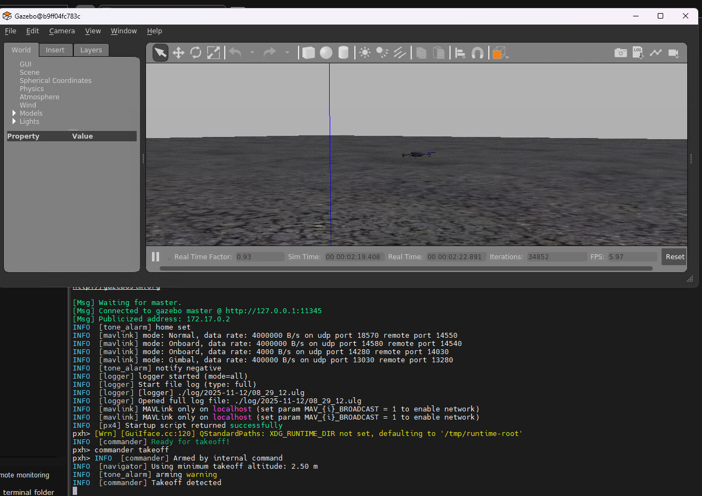

# px4 仿真环境搭建运行

* 本文采用 docker 容器搭建 px4 的仿真运行环境
  * 容器镜像使用: ubuntu 20.04
  * px4 使用版本为：v1.14.2

## px4 环境安装

* 源文档： https://docs.px4.io/v1.14/en/dev_setup/dev_env_linux_ubuntu.html#simulation-and-nuttx-pixhawk-targets

```bash
git clone https://github.com/PX4/PX4-Autopilot.git --recursive
git checkout v1.4.2
bash ./PX4-Autopilot/Tools/setup/ubuntu.sh --no-nuttx
```

* 报错 ：```ERROR: Invalid requirement: 'matplotlib>=3.0.*': .* suffix can only be used with `==` or `!=` operatorsmatplotlib>=3.0.*~~~~~~^ (from line 11 of /root/ws/PX4-Autopilot/Tools/setup/requirements.txt)```
  * 改成 `matplotlib>=3.0.0`

## px4 仿真编译启动

* 源文档：https://docs.px4.io/v1.14/en/sim_gazebo_gz/gazebo_vehicles.html

```bash
make px4_sitl gazebo-classic
```

* 报错 `.pb.h:12:2: error: #error This file was generated by a newer version of protoc`

```bash
/usr/include/gazebo-11/gazebo/msgs/quaternion.pb.h:12:2: error: #error This file was generated by a newer version of protoc which is
   12 | #error This file was generated by a newer version of protoc which is
      |  ^~~~~
/usr/include/gazebo-11/gazebo/msgs/quaternion.pb.h:13:2: error: #error incompatible with your Protocol Buffer headers. Please update
   13 | #error incompatible with your Protocol Buffer headers.  Please update
      |  ^~~~~
/usr/include/gazebo-11/gazebo/msgs/quaternion.pb.h:14:2: error: #error your headers.
   14 | #error your headers.
      |  ^~~~~
In file included from /root/ws/PX4-Autopilot/build/px4_sitl_default/build_gazebo-classic/Odometry.pb.h:34,
                 from /root/ws/PX4-Autopilot/build/px4_sitl_default/build_gazebo-classic/Odometry.pb.cc:4:
/usr/include/gazebo-11/gazebo/msgs/vector3d.pb.h:12:2: error: #error This file was generated by a newer version of protoc which is
   12 | #error This file was generated by a newer version of protoc which is
      |  ^~~~~
/usr/include/gazebo-11/gazebo/msgs/vector3d.pb.h:13:2: error: #error incompatible with your Protocol Buffer headers. Please update
   13 | #error incompatible with your Protocol Buffer headers.  Please update
      |  ^~~~~
```

* 容器环境 里之前手动安装过 protobuf ，导致px4 找错 ，重新安装下；
* https://github.com/protocolbuffers/protobuf/blob/v3.6.1.3/src/README.md

## px4 仿真运行

* 使用 mobaxterm 通过 ssh 连接docker容器，运行如下：


