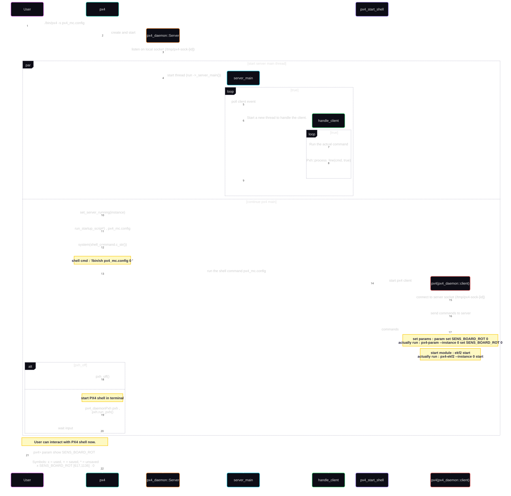

# px4启动流程分析

* 简单分析以下px4 的启动流程，加深下对px4 框架的理解。
* 以linux平台 (platforms/posix) 进行分析。

## 启动 px4 主函数

### cmake 编译对象 px4

* 通过搜索 `add_executable` 可以找到px4 主程序的编译配置：

```bash
### px4/platforms/posix/CMakeLists.txt

add_executable(px4
src/px4/common/main.cpp
apps.cpp
)

# ...

target_link_libraries(px4
PRIVATE
  ${module_libraries}
  m
  parameters
)

```

* 编译对象 `px4` 就是要生成的主程序，位置在 `src/px4/common/main.cpp`
  * `apps.cpp` 这个编译过程中生成的文件，作用是导出 `module` 入口函数，这个后面再详细说。
* 连接对象 `${module_libraries}` 就是实际需要的 `module` 的列表，编译时生成。

### px4 main函数

* main 函数入口如下：

```c++
/// px4/platforms/posix/src/px4/common/main.cpp
#ifdef __PX4_SITL_MAIN_OVERRIDE
extern "C" {
__EXPORT int SITL_MAIN(int argc, char **argv);
}

int SITL_MAIN(int argc, char **argv)
#else
int main(int argc, char **argv)
#endif
{
	bool is_client = false;
	bool pxh_off = false;
	bool server_is_running = false;

	/* Symlinks point to all commands that can be used as a client with a prefix. */
	const char prefix[] = PX4_SHELL_COMMAND_PREFIX;
	int path_length = 0;

	std::string absolute_binary_path; // full path to the px4 binary being executed

```

* 可以看到有一个宏定义 `__PX4_SITL_MAIN_OVERRIDE`, 这个可以用来把 `main` 函数变成 `SITL_MAIN`，相当于把px4编译成动态库而不是主程序；
  * 特殊情况下会用到，外部去加载px4程序；

### `apps.cpp` 生成文件(组件注册表)

* 该文件如下(编译时生成)：

```c++
/// px4/build/linux_t113/platforms/posix/apps.cpp

#include <cstdlib>

#define MODULE_NAME "px4"

extern "C" {

int cdev_test_main(int argc, char *argv[]);
int controllib_test_main(int argc, char *argv[]);
int rc_tests_main(int argc, char *argv[]);
int uorb_tests_main(int argc, char *argv[]);
int wqueue_test_main(int argc, char *argv[]);
int auxio_main(int argc, char *argv[]);
int bmp388_main(int argc, char *argv[]);
int gps_main(int argc, char *argv[]);
int bmi088_main(int argc, char *argv[]);
int ist8310_main(int argc, char *argv[]);
int linux_pwm_out_main(int argc, char *argv[]);

// ...

void init_app_map(apps_map_type &apps)
{
	apps["cdev_test"] = cdev_test_main;
	apps["controllib_test"] = controllib_test_main;
	apps["rc_tests"] = rc_tests_main;
	apps["uorb_tests"] = uorb_tests_main;
	apps["wqueue_test"] = wqueue_test_main;
	apps["auxio"] = auxio_main;
	apps["linux_pwm_out"] = linux_pwm_out_main;

```

* app.h 文件：

```c++
/// px4/build/linux_t113/platforms/posix/apps.h

#pragma once

#include <px4_platform_common/tasks.h>	// px4_main_t
#include <map>
#include <string>

// Maps an app name to it's function.
typedef std::map<std::string, px4_main_t> apps_map_type;

// Initialize an apps map.
__EXPORT void init_app_map(apps_map_type &apps);

// List an apps map.
__EXPORT void list_builtins(apps_map_type &apps);
```

* 通过该文件我们就能明白 px4 `module` 模块组件的整个注册机制，以 `linux_pwm_out` 模块举例：
  * `linux_pwm_out` 导出入口启动函数 `extern "C" __EXPORT int linux_pwm_out_main(int argc, char *argv[])`
  * px4 编译时生成 `apps.cpp` 组件注册表函数 `init_app_map`, 包含 `apps["linux_pwm_out"] = linux_pwm_out_main;` 的注册；
  * `module` 模块组件启动按照组件 `name`从map里找到对应入口函数去启动。

## px4 启动流程序列图

* 简单画了以下 px4 启动流程，如下：


* px4 主要是 单进程 多线程运行的；
* 启动脚本 `px4_mc.config` 是通过 启动px4进程 `px4_daemon::Client` 将命令送给 `px4_daemon::Server` 运行的;
  * 所以启动设置过程中，会有多个 px4 的进程，通过 `px -aux | grep px4` 可以查看到；
  * 启动完成后，只有一个px4进程(`px4_daemon::Server`);
* pxh 是 px4 的命令行工具，默认启动，通过设置启动参数加 `-d` 可以关闭；

## px4 启动线程分析

* px4 默认编译带debug信息，直接用gdb查看运行中的px4 , 使用 `gdb attach [px4 pid]`:

```bash
Using host libthread_db library "/lib/x86_64-linux-gnu/libthread_db.so.1".
__GI___libc_read (nbytes=1, buf=0x7fa57ecdcb23 <_IO_2_1_stdin_+131>, fd=0) at ../sysdeps/unix/sysv/linux/read.c:26
26      ../sysdeps/unix/sysv/linux/read.c: No such file or directory.
(gdb) thread apply all bt

Thread 16 (Thread 0x7fa57aa01a40 (LWP 10276) "mavlink_rcv_if0"):
#0  0x00007fa57ebdabcf in __GI___poll (fds=fds@entry=0x7fa57a9ff078, nfds=nfds@entry=1, timeout=timeout@entry=10) at ../sysdeps/unix/sysv/linux/poll.c:29
#1  0x00005595cc04259b in poll (__timeout=10, __nfds=1, __fds=0x7fa57a9ff078) at /usr/include/x86_64-linux-gnu/bits/poll2.h:39
#2  MavlinkReceiver::run (this=<optimized out>) at /opt/tong/ws/px4/PX4_Autopilot/3rd/px4/src/modules/mavlink/mavlink_receiver.cpp:3120
#3  0x00005595cc043d6d in MavlinkReceiver::start_trampoline (context=<optimized out>) at /opt/tong/ws/px4/PX4_Autopilot/3rd/px4/src/modules/mavlink/mavlink_receiver.cpp:3484
#4  0x00007fa57eb56ac3 in start_thread (arg=<optimized out>) at ./nptl/pthread_create.c:442
#5  0x00007fa57ebe7a04 in clone () at ../sysdeps/unix/sysv/linux/x86_64/clone.S:100

Thread 15 (Thread 0x7fa57aa18380 (LWP 10274) "mavlink_if0"):
#0  0x00007fa57eba77f8 in __GI___clock_nanosleep (clock_id=clock_id@entry=0, flags=flags@entry=0, req=req@entry=0x7fa57aa178d0, rem=rem@entry=0x0) at ../sysdeps/unix/sysv/linux/clock_nanosleep.c:78
#1  0x00007fa57ebac677 in __GI___nanosleep (req=req@entry=0x7fa57aa178d0, rem=rem@entry=0x0) at ../sysdeps/unix/sysv/linux/nanosleep.c:25
#2  0x00007fa57ebddf2f in usleep (useconds=<optimized out>) at ../sysdeps/posix/usleep.c:31
#3  0x00005595cc0170bc in Mavlink::task_main (this=0x7fa54c000b70, argc=<optimized out>, argv=<optimized out>) at /opt/tong/ws/px4/PX4_Autopilot/3rd/px4/src/modules/mavlink/mavlink_main.cpp:2207
#4  0x00005595cc01aacb in Mavlink::start_helper (argc=11, argv=0x7fa558009770) at /opt/tong/ws/px4/PX4_Autopilot/3rd/px4/src/modules/mavlink/mavlink_main.cpp:2709
#5  0x00005595cc125a2d in entry_adapter (ptr=0x7fa558009750) at /opt/tong/ws/px4/PX4_Autopilot/3rd/px4/platforms/posix/src/px4/common/tasks.cpp:98
#6  0x00007fa57eb56ac3 in start_thread (arg=<optimized out>) at ./nptl/pthread_create.c:442
#7  0x00007fa57ebe7a04 in clone () at ../sysdeps/unix/sysv/linux/x86_64/clone.S:100

Thread 14 (Thread 0x7fa57aa27640 (LWP 10268) "commander"):
#0  0x00007fa57eba77f8 in __GI___clock_nanosleep (clock_id=clock_id@entry=0, flags=flags@entry=0, req=req@entry=0x7fa57aa26d40, rem=rem@entry=0x0) at ../sysdeps/unix/sysv/linux/clock_nanosleep.c:78
#1  0x00007fa57ebac677 in __GI___nanosleep (req=req@entry=0x7fa57aa26d40, rem=rem@entry=0x0) at ../sysdeps/unix/sysv/linux/nanosleep.c:25
#2  0x00007fa57ebddf2f in usleep (useconds=<optimized out>) at ../sysdeps/posix/usleep.c:31
#3  0x00005595cbf774b3 in Commander::run (this=0x7fa548000b70) at /opt/tong/ws/px4/PX4_Autopilot/3rd/px4/src/modules/commander/Commander.cpp:1841
#4  0x00005595cbf7adbd in ModuleBase<Commander>::run_trampoline (argc=<optimized out>, argv=<optimized out>) at /opt/tong/ws/px4/PX4_Autopilot/3rd/px4/platforms/common/include/px4_platform_common/module.h:180
#5  0x00005595cc125a2d in entry_adapter (ptr=0x7fa558008e00) at /opt/tong/ws/px4/PX4_Autopilot/3rd/px4/platforms/posix/src/px4/common/tasks.cpp:98
#6  0x00007fa57eb56ac3 in start_thread (arg=<optimized out>) at ./nptl/pthread_create.c:442
#7  0x00007fa57ebe7a04 in clone () at ../sysdeps/unix/sysv/linux/x86_64/clone.S:100

Thread 13 (Thread 0x7fa57aa3c4c0 (LWP 10135) "navigator"):
#0  __futex_abstimed_wait_common64 (private=0, cancel=true, abstime=0x7fa57aa3b9a0, op=137, expected=0, futex_word=0x7fa57aa3ba00) at ./nptl/futex-internal.c:57
#1  __futex_abstimed_wait_common (cancel=true, private=0, abstime=0x7fa57aa3b9a0, clockid=0, expected=0, futex_word=0x7fa57aa3ba00) at ./nptl/futex-internal.c:87
#2  __GI___futex_abstimed_wait_cancelable64 (futex_word=futex_word@entry=0x7fa57aa3ba00, expected=expected@entry=0, clockid=clockid@entry=1, abstime=abstime@entry=0x7fa57aa3b9a0, private=private@entry=0) at ./nptl/futex-internal.c:139
#3  0x00007fa57eb55e9b in __pthread_cond_wait_common (abstime=0x7fa57aa3b9a0, clockid=1, mutex=0x7fa57aa3b9b0, cond=0x7fa57aa3b9d8) at ./nptl/pthread_cond_wait.c:503
#4  ___pthread_cond_timedwait64 (cond=0x7fa57aa3b9d8, mutex=0x7fa57aa3b9b0, abstime=0x7fa57aa3b9a0) at ./nptl/pthread_cond_wait.c:652
#5  0x00005595cc125f57 in px4_sem_timedwait (s=0x7fa57aa3b9b0, abstime=0x7fa57aa3b9a0) at /opt/tong/ws/px4/PX4_Autopilot/3rd/px4/platforms/posix/src/px4/common/px4_sem.cpp:137
#6  0x00005595cc11d4bb in px4_poll (fds=0x7fa57aa3bb70, nfds=<optimized out>, timeout=1000) at /opt/tong/ws/px4/PX4_Autopilot/3rd/px4/src/lib/cdev/posix/cdev_platform.cpp:405
#7  0x00005595cc06d99e in Navigator::run (this=0x7fa554000b70) at /opt/tong/ws/px4/PX4_Autopilot/3rd/px4/src/modules/navigator/navigator_main.cpp:177
#8  0x00005595cc06d20e in ModuleBase<Navigator>::run_trampoline (argc=<optimized out>, argv=<optimized out>) at /opt/tong/ws/px4/PX4_Autopilot/3rd/px4/platforms/common/include/px4_platform_common/module.h:180
#9  0x00005595cc125a2d in entry_adapter (ptr=0x7fa558004f30) at /opt/tong/ws/px4/PX4_Autopilot/3rd/px4/platforms/posix/src/px4/common/tasks.cpp:98
#10 0x00007fa57eb56ac3 in start_thread (arg=<optimized out>) at ./nptl/pthread_create.c:442
#11 0x00007fa57ebe7a04 in clone () at ../sysdeps/unix/sysv/linux/x86_64/clone.S:100

Thread 12 (Thread 0x7fa57aa45640 (LWP 10132) "wq:rate_ctrl"):
#0  __futex_abstimed_wait_common64 (private=0, cancel=true, abstime=0x0, op=393, expected=0, futex_word=0x7fa57aa44d58) at ./nptl/futex-internal.c:57
#1  __futex_abstimed_wait_common (cancel=true, private=0, abstime=0x0, clockid=0, expected=0, futex_word=0x7fa57aa44d58) at ./nptl/futex-internal.c:87
#2  __GI___futex_abstimed_wait_cancelable64 (futex_word=futex_word@entry=0x7fa57aa44d58, expected=expected@entry=0, clockid=clockid@entry=0, abstime=abstime@entry=0x0, private=private@entry=0) at ./nptl/futex-internal.c:139
#3  0x00007fa57eb55a41 in __pthread_cond_wait_common (abstime=0x0, clockid=0, mutex=0x7fa57aa44d08, cond=0x7fa57aa44d30) at ./nptl/pthread_cond_wait.c:503
#4  ___pthread_cond_wait (cond=0x7fa57aa44d30, mutex=0x7fa57aa44d08) at ./nptl/pthread_cond_wait.c:627
#5  0x00005595cc125e3c in px4_sem_wait (s=0x7fa57aa44d08) at /opt/tong/ws/px4/PX4_Autopilot/3rd/px4/platforms/posix/src/px4/common/px4_sem.cpp:89
#6  0x00005595cc1277f8 in px4::WorkQueue::Run (this=this@entry=0x7fa57aa44c90) at /opt/tong/ws/px4/PX4_Autopilot/3rd/px4/platforms/common/px4_work_queue/WorkQueue.cpp:178
#7  0x00005595cc127e4e in px4::WorkQueueRunner (context=<optimized out>) at /opt/tong/ws/px4/PX4_Autopilot/3rd/px4/platforms/common/px4_work_queue/WorkQueueManager.cpp:237
#8  0x00007fa57eb56ac3 in start_thread (arg=<optimized out>) at ./nptl/pthread_create.c:442
#9  0x00007fa57ebe7a04 in clone () at ../sysdeps/unix/sysv/linux/x86_64/clone.S:100

Thread 11 (Thread 0x7fa57aa4e640 (LWP 10131) "wq:manager"):
#0  __futex_abstimed_wait_common64 (private=0, cancel=true, abstime=0x0, op=393, expected=0, futex_word=0x7fa57aa4dd58) at ./nptl/futex-internal.c:57
#1  __futex_abstimed_wait_common (cancel=true, private=0, abstime=0x0, clockid=0, expected=0, futex_word=0x7fa57aa4dd58) at ./nptl/futex-internal.c:87
#2  __GI___futex_abstimed_wait_cancelable64 (futex_word=futex_word@entry=0x7fa57aa4dd58, expected=expected@entry=0, clockid=clockid@entry=0, abstime=abstime@entry=0x0, private=private@entry=0) at ./nptl/futex-internal.c:139
#3  0x00007fa57eb55a41 in __pthread_cond_wait_common (abstime=0x0, clockid=0, mutex=0x7fa57aa4dd08, cond=0x7fa57aa4dd30) at ./nptl/pthread_cond_wait.c:503
#4  ___pthread_cond_wait (cond=0x7fa57aa4dd30, mutex=0x7fa57aa4dd08) at ./nptl/pthread_cond_wait.c:627
#5  0x00005595cc125e3c in px4_sem_wait (s=0x7fa57aa4dd08) at /opt/tong/ws/px4/PX4_Autopilot/3rd/px4/platforms/posix/src/px4/common/px4_sem.cpp:89
#6  0x00005595cc1277f8 in px4::WorkQueue::Run (this=this@entry=0x7fa57aa4dc90) at /opt/tong/ws/px4/PX4_Autopilot/3rd/px4/platforms/common/px4_work_queue/WorkQueue.cpp:178
#7  0x00005595cc127e4e in px4::WorkQueueRunner (context=<optimized out>) at /opt/tong/ws/px4/PX4_Autopilot/3rd/px4/platforms/common/px4_work_queue/WorkQueueManager.cpp:237
#8  0x00007fa57eb56ac3 in start_thread (arg=<optimized out>) at ./nptl/pthread_create.c:442
#9  0x00007fa57ebe7a04 in clone () at ../sysdeps/unix/sysv/linux/x86_64/clone.S:100


Thread 10 (Thread 0x7fa57aa56640 (LWP 10126) "wq:hp_default"):
#0  __futex_abstimed_wait_common64 (private=0, cancel=true, abstime=0x0, op=393, expected=0, futex_word=0x7fa57aa55d58) at ./nptl/futex-internal.c:57
#1  __futex_abstimed_wait_common (cancel=true, private=0, abstime=0x0, clockid=0, expected=0, futex_word=0x7fa57aa55d58) at ./nptl/futex-internal.c:87
#2  __GI___futex_abstimed_wait_cancelable64 (futex_word=futex_word@entry=0x7fa57aa55d58, expected=expected@entry=0, clockid=clockid@entry=0, abstime=abstime@entry=0x0, private=private@entry=0) at ./nptl/futex-internal.c:139
#3  0x00007fa57eb55a41 in __pthread_cond_wait_common (abstime=0x0, clockid=0, mutex=0x7fa57aa55d08, cond=0x7fa57aa55d30) at ./nptl/pthread_cond_wait.c:503
#4  ___pthread_cond_wait (cond=0x7fa57aa55d30, mutex=0x7fa57aa55d08) at ./nptl/pthread_cond_wait.c:627
#5  0x00005595cc125e3c in px4_sem_wait (s=0x7fa57aa55d08) at /opt/tong/ws/px4/PX4_Autopilot/3rd/px4/platforms/posix/src/px4/common/px4_sem.cpp:89
#6  0x00005595cc1277f8 in px4::WorkQueue::Run (this=this@entry=0x7fa57aa55c90) at /opt/tong/ws/px4/PX4_Autopilot/3rd/px4/platforms/common/px4_work_queue/WorkQueue.cpp:178
#7  0x00005595cc127e4e in px4::WorkQueueRunner (context=<optimized out>) at /opt/tong/ws/px4/PX4_Autopilot/3rd/px4/platforms/common/px4_work_queue/WorkQueueManager.cpp:237
#8  0x00007fa57eb56ac3 in start_thread (arg=<optimized out>) at ./nptl/pthread_create.c:442
#9  0x00007fa57ebe7a04 in clone () at ../sysdeps/unix/sysv/linux/x86_64/clone.S:100

Thread 9 (Thread 0x7fa57aa5e640 (LWP 10123) "wq:ttyS5"):
#0  __futex_abstimed_wait_common64 (private=0, cancel=true, abstime=0x0, op=393, expected=0, futex_word=0x7fa57aa5dd5c) at ./nptl/futex-internal.c:57
#1  __futex_abstimed_wait_common (cancel=true, private=0, abstime=0x0, clockid=0, expected=0, futex_word=0x7fa57aa5dd5c) at ./nptl/futex-internal.c:87
#2  __GI___futex_abstimed_wait_cancelable64 (futex_word=futex_word@entry=0x7fa57aa5dd5c, expected=expected@entry=0, clockid=clockid@entry=0, abstime=abstime@entry=0x0, private=private@entry=0) at ./nptl/futex-internal.c:139
#3  0x00007fa57eb55a41 in __pthread_cond_wait_common (abstime=0x0, clockid=0, mutex=0x7fa57aa5dd08, cond=0x7fa57aa5dd30) at ./nptl/pthread_cond_wait.c:503
#4  ___pthread_cond_wait (cond=0x7fa57aa5dd30, mutex=0x7fa57aa5dd08) at ./nptl/pthread_cond_wait.c:627
#5  0x00005595cc125e3c in px4_sem_wait (s=0x7fa57aa5dd08) at /opt/tong/ws/px4/PX4_Autopilot/3rd/px4/platforms/posix/src/px4/common/px4_sem.cpp:89
#6  0x00005595cc1277f8 in px4::WorkQueue::Run (this=this@entry=0x7fa57aa5dc90) at /opt/tong/ws/px4/PX4_Autopilot/3rd/px4/platforms/common/px4_work_queue/WorkQueue.cpp:178
#7  0x00005595cc127e4e in px4::WorkQueueRunner (context=<optimized out>) at /opt/tong/ws/px4/PX4_Autopilot/3rd/px4/platforms/common/px4_work_queue/WorkQueueManager.cpp:237
#8  0x00007fa57eb56ac3 in start_thread (arg=<optimized out>) at ./nptl/pthread_create.c:442
#9  0x00007fa57ebe7a04 in clone () at ../sysdeps/unix/sysv/linux/x86_64/clone.S:100

Thread 8 (Thread 0x7fa57f025640 (LWP 10108) "wq:lp_default"):
#0  __futex_abstimed_wait_common64 (private=0, cancel=true, abstime=0x0, op=393, expected=0, futex_word=0x7fa57f024d58) at ./nptl/futex-internal.c:57
#1  __futex_abstimed_wait_common (cancel=true, private=0, abstime=0x0, clockid=0, expected=0, futex_word=0x7fa57f024d58) at ./nptl/futex-internal.c:87
#2  __GI___futex_abstimed_wait_cancelable64 (futex_word=futex_word@entry=0x7fa57f024d58, expected=expected@entry=0, clockid=clockid@entry=0, abstime=abstime@entry=0x0, private=private@entry=0) at ./nptl/futex-internal.c:139
#3  0x00007fa57eb55a41 in __pthread_cond_wait_common (abstime=0x0, clockid=0, mutex=0x7fa57f024d08, cond=0x7fa57f024d30) at ./nptl/pthread_cond_wait.c:503
#4  ___pthread_cond_wait (cond=0x7fa57f024d30, mutex=0x7fa57f024d08) at ./nptl/pthread_cond_wait.c:627
#5  0x00005595cc125e3c in px4_sem_wait (s=0x7fa57f024d08) at /opt/tong/ws/px4/PX4_Autopilot/3rd/px4/platforms/posix/src/px4/common/px4_sem.cpp:89
#6  0x00005595cc1277f8 in px4::WorkQueue::Run (this=this@entry=0x7fa57f024c90) at /opt/tong/ws/px4/PX4_Autopilot/3rd/px4/platforms/common/px4_work_queue/WorkQueue.cpp:178
#7  0x00005595cc127e4e in px4::WorkQueueRunner (context=<optimized out>) at /opt/tong/ws/px4/PX4_Autopilot/3rd/px4/platforms/common/px4_work_queue/WorkQueueManager.cpp:237
#8  0x00007fa57eb56ac3 in start_thread (arg=<optimized out>) at ./nptl/pthread_create.c:442
#9  0x00007fa57ebe7a04 in clone () at ../sysdeps/unix/sysv/linux/x86_64/clone.S:100

Thread 7 (Thread 0x7fa57aa96ac0 (LWP 10105) "dataman"):
#0  __futex_abstimed_wait_common64 (private=0, cancel=true, abstime=0x0, op=393, expected=0, futex_word=0x5595cc2a5494 <g_work_queued_sema+84>) at ./nptl/futex-internal.c:57
#1  __futex_abstimed_wait_common (cancel=true, private=0, abstime=0x0, clockid=0, expected=0, futex_word=0x5595cc2a5494 <g_work_queued_sema+84>) at ./nptl/futex-internal.c:87
#2  __GI___futex_abstimed_wait_cancelable64 (futex_word=futex_word@entry=0x5595cc2a5494 <g_work_queued_sema+84>, expected=expected@entry=0, clockid=clockid@entry=0, abstime=abstime@entry=0x0, private=private@entry=0) at ./nptl/futex-internal.c:139
#3  0x00007fa57eb55a41 in __pthread_cond_wait_common (abstime=0x0, clockid=0, mutex=0x5595cc2a5440 <g_work_queued_sema>, cond=0x5595cc2a5468 <g_work_queued_sema+40>) at ./nptl/pthread_cond_wait.c:503
#4  ___pthread_cond_wait (cond=0x5595cc2a5468 <g_work_queued_sema+40>, mutex=0x5595cc2a5440 <g_work_queued_sema>) at ./nptl/pthread_cond_wait.c:627
#5  0x00005595cc125e3c in px4_sem_wait (s=0x5595cc2a5440 <g_work_queued_sema>) at /opt/tong/ws/px4/PX4_Autopilot/3rd/px4/platforms/posix/src/px4/common/px4_sem.cpp:89
#6  0x00005595cbf8f99a in task_main (argc=<optimized out>, argv=<optimized out>) at /opt/tong/ws/px4/PX4_Autopilot/3rd/px4/src/modules/dataman/dataman.cpp:1029
#7  task_main (argc=<optimized out>, argv=<optimized out>) at /opt/tong/ws/px4/PX4_Autopilot/3rd/px4/src/modules/dataman/dataman.cpp:941
#8  0x00005595cc125a2d in entry_adapter (ptr=0x7fa570002550) at /opt/tong/ws/px4/PX4_Autopilot/3rd/px4/platforms/posix/src/px4/common/tasks.cpp:98
#9  0x00007fa57eb56ac3 in start_thread (arg=<optimized out>) at ./nptl/pthread_create.c:442
#10 0x00007fa57ebe7a04 in clone () at ../sysdeps/unix/sysv/linux/x86_64/clone.S:100

Thread 6 (Thread 0x7fa57aaaba40 (LWP 10015) "wq:manager"):
#0  __futex_abstimed_wait_common64 (private=0, cancel=true, abstime=0x0, op=393, expected=0, futex_word=0x7fa56c000c94) at ./nptl/futex-internal.c:57
#1  __futex_abstimed_wait_common (cancel=true, private=0, abstime=0x0, clockid=0, expected=0, futex_word=0x7fa56c000c94) at ./nptl/futex-internal.c:87
#2  __GI___futex_abstimed_wait_cancelable64 (futex_word=futex_word@entry=0x7fa56c000c94, expected=expected@entry=0, clockid=clockid@entry=0, abstime=abstime@entry=0x0, private=private@entry=0) at ./nptl/futex-internal.c:139
#3  0x00007fa57eb55a41 in __pthread_cond_wait_common (abstime=0x0, clockid=0, mutex=0x7fa56c000c40, cond=0x7fa56c000c68) at ./nptl/pthread_cond_wait.c:503
#4  ___pthread_cond_wait (cond=0x7fa56c000c68, mutex=0x7fa56c000c40) at ./nptl/pthread_cond_wait.c:627
#5  0x00005595cc125e3c in px4_sem_wait (s=0x7fa56c000c40) at /opt/tong/ws/px4/PX4_Autopilot/3rd/px4/platforms/posix/src/px4/common/px4_sem.cpp:89
#6  0x00005595cc127ab0 in BlockingQueue<px4::wq_config_t const*, 1ul>::pop (this=0x7fa56c000be0) at /opt/tong/ws/px4/PX4_Autopilot/3rd/px4/src/include/containers/BlockingQueue.hpp:67
#7  px4::WorkQueueManagerRun () at /opt/tong/ws/px4/PX4_Autopilot/3rd/px4/platforms/common/px4_work_queue/WorkQueueManager.cpp:264
#8  0x00005595cc125a2d in entry_adapter (ptr=0x5595cdd31c20) at /opt/tong/ws/px4/PX4_Autopilot/3rd/px4/platforms/posix/src/px4/common/tasks.cpp:98
#9  0x00007fa57eb56ac3 in start_thread (arg=<optimized out>) at ./nptl/pthread_create.c:442
#10 0x00007fa57ebe7a04 in clone () at ../sysdeps/unix/sysv/linux/x86_64/clone.S:100

Thread 5 (Thread 0x7fa57aabb640 (LWP 10014) "wkr_hrt"):
#0  0x00007fa57eba77f8 in __GI___clock_nanosleep (clock_id=clock_id@entry=0, flags=flags@entry=0, req=req@entry=0x7fa57aabadd0, rem=rem@entry=0x0) at ../sysdeps/unix/sysv/linux/clock_nanosleep.c:78
#1  0x00007fa57ebac677 in __GI___nanosleep (req=req@entry=0x7fa57aabadd0, rem=rem@entry=0x0) at ../sysdeps/unix/sysv/linux/nanosleep.c:25
--Type <RET> for more, q to quit, c to continue without paging--
#2  0x00007fa57ebddf2f in usleep (useconds=useconds@entry=2282) at ../sysdeps/posix/usleep.c:31
#3  0x00005595cc12d78e in hrt_work_process () at /opt/tong/ws/px4/PX4_Autopilot/3rd/px4/platforms/common/work_queue/hrt_thread.c:232
#4  work_hrtthread (argc=<optimized out>, argv=<optimized out>) at /opt/tong/ws/px4/PX4_Autopilot/3rd/px4/platforms/common/work_queue/hrt_thread.c:276
#5  0x00005595cc125a2d in entry_adapter (ptr=0x5595cdd31a00) at /opt/tong/ws/px4/PX4_Autopilot/3rd/px4/platforms/posix/src/px4/common/tasks.cpp:98
#6  0x00007fa57eb56ac3 in start_thread (arg=<optimized out>) at ./nptl/pthread_create.c:442
#7  0x00007fa57ebe7a04 in clone () at ../sysdeps/unix/sysv/linux/x86_64/clone.S:100

Thread 4 (Thread 0x7fa57f034640 (LWP 10013) "lpwork"):
#0  0x00007fa57eba77f8 in __GI___clock_nanosleep (clock_id=clock_id@entry=0, flags=flags@entry=0, req=req@entry=0x7fa57f033e00, rem=rem@entry=0x0) at ../sysdeps/unix/sysv/linux/clock_nanosleep.c:78
#1  0x00007fa57ebac677 in __GI___nanosleep (req=req@entry=0x7fa57f033e00, rem=rem@entry=0x0) at ../sysdeps/unix/sysv/linux/nanosleep.c:25
#2  0x00007fa57ebddf2f in usleep (useconds=<optimized out>) at ../sysdeps/posix/usleep.c:31
#3  0x00005595cc12dc52 in work_process (wqueue=wqueue@entry=0x5595cc2abcb8 <g_work+24>, lock_id=lock_id@entry=1) at /opt/tong/ws/px4/PX4_Autopilot/3rd/px4/platforms/common/work_queue/work_thread.c:194
#4  0x00005595cc12dcbd in work_lpthread (argc=<optimized out>, argv=<optimized out>) at /opt/tong/ws/px4/PX4_Autopilot/3rd/px4/platforms/common/work_queue/work_thread.c:305
#5  0x00005595cc125a2d in entry_adapter (ptr=0x5595cdd31890) at /opt/tong/ws/px4/PX4_Autopilot/3rd/px4/platforms/posix/src/px4/common/tasks.cpp:98
#6  0x00007fa57eb56ac3 in start_thread (arg=<optimized out>) at ./nptl/pthread_create.c:442
#7  0x00007fa57ebe7a04 in clone () at ../sysdeps/unix/sysv/linux/x86_64/clone.S:100

Thread 3 (Thread 0x7fa57f043640 (LWP 10012) "hpwork"):
#0  0x00007fa57eba77f8 in __GI___clock_nanosleep (clock_id=clock_id@entry=0, flags=flags@entry=0, req=req@entry=0x7fa57f042e00, rem=rem@entry=0x0) at ../sysdeps/unix/sysv/linux/clock_nanosleep.c:78
#1  0x00007fa57ebac677 in __GI___nanosleep (req=req@entry=0x7fa57f042e00, rem=rem@entry=0x0) at ../sysdeps/unix/sysv/linux/nanosleep.c:25
#2  0x00007fa57ebddf2f in usleep (useconds=<optimized out>) at ../sysdeps/posix/usleep.c:31
#3  0x00005595cc12dc52 in work_process (wqueue=wqueue@entry=0x5595cc2abca0 <g_work>, lock_id=lock_id@entry=0) at /opt/tong/ws/px4/PX4_Autopilot/3rd/px4/platforms/common/work_queue/work_thread.c:194
#4  0x00005595cc12dc9a in work_hpthread (argc=<optimized out>, argv=<optimized out>) at /opt/tong/ws/px4/PX4_Autopilot/3rd/px4/platforms/common/work_queue/work_thread.c:279
#5  0x00005595cc125a2d in entry_adapter (ptr=0x5595cdd31720) at /opt/tong/ws/px4/PX4_Autopilot/3rd/px4/platforms/posix/src/px4/common/tasks.cpp:98
#6  0x00007fa57eb56ac3 in start_thread (arg=<optimized out>) at ./nptl/pthread_create.c:442
#7  0x00007fa57ebe7a04 in clone () at ../sysdeps/unix/sysv/linux/x86_64/clone.S:100

Thread 2 (Thread 0x7fa57eabc640 (LWP 10011) "px4"):
#0  0x00007fa57ebdabcf in __GI___poll (fds=0x7fa574000ee0, nfds=1, timeout=-1) at ../sysdeps/unix/sysv/linux/poll.c:29
#1  0x00005595cc12cd4e in poll (__timeout=-1, __nfds=1, __fds=<optimized out>) at /usr/include/x86_64-linux-gnu/bits/poll2.h:39
#2  px4_daemon::Server::_server_main (this=0x7fffb5e9dbf0) at /opt/tong/ws/px4/PX4_Autopilot/3rd/px4/platforms/posix/src/px4/common/px4_daemon/server.cpp:150
#3  0x00005595cc12d30d in px4_daemon::Server::_server_main_trampoline (self=<optimized out>) at /opt/tong/ws/px4/PX4_Autopilot/3rd/px4/platforms/posix/src/px4/common/px4_daemon/server.cpp:120
#4  0x00007fa57eb56ac3 in start_thread (arg=<optimized out>) at ./nptl/pthread_create.c:442
#5  0x00007fa57ebe7a04 in clone () at ../sysdeps/unix/sysv/linux/x86_64/clone.S:100

--Type <RET> for more, q to quit, c to continue without paging--
Thread 1 (Thread 0x7fa57eabd740 (LWP 10010) "px4"):
#0  __GI___libc_read (nbytes=1, buf=0x7fa57ecdcb23 <_IO_2_1_stdin_+131>, fd=0) at ../sysdeps/unix/sysv/linux/read.c:26
#1  __GI___libc_read (fd=0, buf=0x7fa57ecdcb23 <_IO_2_1_stdin_+131>, nbytes=1) at ../sysdeps/unix/sysv/linux/read.c:24
#2  0x00007fa57eb4ec36 in _IO_new_file_underflow (fp=0x7fa57ecdcaa0 <_IO_2_1_stdin_>) at ./libio/libioP.h:947
#3  0x00007fa57eb4fd96 in __GI__IO_default_uflow (fp=0x7fa57ecdcaa0 <_IO_2_1_stdin_>) at ./libio/libioP.h:947
#4  0x00007fa57eb49a98 in _IO_getc (fp=0x7fa57ecdcaa0 <_IO_2_1_stdin_>) at ./libio/getc.c:40
#5  0x00005595cc12b357 in getchar () at /usr/include/x86_64-linux-gnu/bits/stdio.h:49
#6  px4_daemon::Pxh::run_pxh (this=this@entry=0x7fffb5e9dc90) at /opt/tong/ws/px4/PX4_Autopilot/3rd/px4/platforms/posix/src/px4/common/px4_daemon/pxh.cpp:312
#7  0x00005595cbf3f799 in main (argc=<optimized out>, argv=<optimized out>) at /opt/tong/ws/px4/PX4_Autopilot/3rd/px4/platforms/posix/src/px4/common/main.cpp:407
(gdb)
(gdb)
(gdb)
```

* 线程数量不少，不过都加了线程名，方便分析

### Thread 1 : px4

* px4 主程序，到最后运行 `px4_daemon::Pxh::run_pxh()`，即 px4 shell;

### Thread 2 : px4

* px4 `px4_daemon::Server` 线程；
* 处理 `Client` 的 指令，用来 设置参数 或 启动 `module` 模块组件；

### Thread 3-4 : hpwork,lpwork

* hpwork: 高优先级任务队列
* lpwork: 低优先级任务队列
* 可以通过 `work_queue` 向指定队列添加任务

```c++
/// px4/platforms/common/work_queue/work_thread.c

// Create high priority worker thread
g_work[HPWORK].pid = px4_task_spawn_cmd("hpwork",
					SCHED_DEFAULT,
					SCHED_PRIORITY_MAX - 1,
					2000,
					work_hpthread,
					(char *const *)NULL);

// Create low priority worker thread
g_work[LPWORK].pid = px4_task_spawn_cmd("lpwork",
					SCHED_DEFAULT,
					SCHED_PRIORITY_MIN,
					2000,
					work_lpthread,
					(char *const *)NULL);
```

### Thread 5 : wkr_hrt

* wkr_hrt ：高优先级 实时任务线程
* 看着实现和 `hpwork` 差不多，都是通过 `px4_usleep(next);` 睡眠等待下一个 task 执行；

```c++
/// px4/platforms/common/work_queue/hrt_thread.c

// Create high priority worker thread
g_hrt_work.pid = px4_task_spawn_cmd("wkr_hrt",
					SCHED_DEFAULT,
					SCHED_PRIORITY_MAX,
					2000,
					work_hrtthread,
					(char *const *)NULL);

```

### Thread 6 : wq:manager

* workqueue manager , 创建管理 任务队列的
  * 通过 `WorkQueue *WorkQueueFindOrCreate(const wq_config_t &new_wq);` 添加新的队列 或获取；
  * 通过 `void WorkQueue::Add(WorkItem *item);` 添加新的任务；

```c++
/// px4/platforms/common/px4_work_queue/WorkQueueManager.cpp

int task_id = px4_task_spawn_cmd("wq:manager",
	SCHED_DEFAULT,
	SCHED_PRIORITY_MAX,
	PX4_STACK_ADJUSTED(1280),
	(px4_main_t)&WorkQueueManagerRun,
	nullptr);
```

### Thread 7 : dataman

* dataman 组件,用来数据持久化的 ，`px4/src/modules/dataman/CMakeLists.txt`
* 以下是模块的介绍：
  * 该模块通过 C API 提供一种简单数据库形式的持久存储，以供系统的其他部分使用。支持多种后端：
    * 文件（例如在 SD 卡上）
    * 内存（显然这不是持久存储）
  * 用于存储不同类型的结构化数据：任务航点、任务状态和电子围栏多边形。
  * 每种类型都有特定的数据类型和固定的最大存储条目数量，从而能够实现快速随机访问。
  * 实现：读取和写入单个条目总是原子的。如果需要原子地读取/修改多个条目，每种条目类型都会通过 `dm_lock` 提供额外的锁

* 使用基本函数 `dm_read(...)` , `dm_write(...)`
* 实际写入 磁盘IO 是通过线程异步的，避免 磁盘IO 的延迟影响；

```c++
/// px4/src/modules/dataman/dataman.cpp

/* start the worker thread with low priority for disk IO */
if ((task = px4_task_spawn_cmd("dataman", SCHED_DEFAULT, SCHED_PRIORITY_DEFAULT - 10,
				PX4_STACK_ADJUSTED(TASK_STACK_SIZE), task_main,
				nullptr)) < 0) {
	px4_sem_destroy(&g_init_sema);
	PX4_ERR("task start failed");
	return -1;
}
```

### Thread 8-12 ： wq:**

* 以下都是通过 `wq:manager` 管理的队列：
  * wq:lp_default ：低优先级队列
  * wq:hp_default ：高优先级队列
  * wq:ttyS5 ：串口serial 数据处理队列
  * wq:manager ：这个版本好像没什么作用，搜索 `wq:manager` 没有向这个队列添加任务；
  * wq:rate_ctrl : 使用该队列组件：`control_allocator`,`mc_rate_control`,`vehicle_angular_velocity`

* 这个应该是新的线程池方案，大部分组件都是通过该线程池接口添加任务的，`hpwork,lpwork` 使用的地方就不多。

### Thread 13: navigator

* 导航组件，贴一下组件描述：
  * 负责自主飞行模式的模块。这包括任务（从数据管理器读取）、起飞和返航。它还负责检查地理围栏违规。
  * 实现：不同的内部模式被实现为继承自共同基类 `NavigatorMode` 的独立类。成员 `_navigation_mode` 包含当前激活的模式。
  * 导航器发布位置设定点三元组（`position_setpoint_triplet_s`），然后由位置控制器使用。

### Thread 14: commander

* 命令组件，给无人机发指令,如：`commander takeoff` , `commander land`, ...

### Thread 15-16: mavlink_if0,mavlink_rcv_if0

* mavlink 组件相关线程；
* mavlink 是用于地面站通信的轻量级消息协议，负责飞行器与外部系统（如QGroundControl）的通信。

### 小结

* 该px4运行堆栈是基于t113编译对象运行的，其他的可能有差异，因为启动的 module 模块组件不同，但原理都是类似的。


## initialize_fake_px4_once

```c++

/// px4/platforms/posix/src/px4/common/main_fuzztesting.cpp

void initialize_fake_px4_once()
{
	static bool first_time = true;

	if (!first_time) {
		return;
	}

	first_time = false;

	px4::init_once();
	px4::init(0, nullptr, "px4");

	px4_daemon::Pxh pxh;
	pxh.process_line("uorb start", true);
	pxh.process_line("param load", true);
	pxh.process_line("dataman start", true);
	pxh.process_line("load_mon start", true);
	pxh.process_line("battery_simulator start", true);
	pxh.process_line("tone_alarm start", true);
	pxh.process_line("rc_update start", true);
	pxh.process_line("sensors start", true);
	pxh.process_line("commander start", true);
	pxh.process_line("navigator start", true);
	pxh.process_line("ekf2 start", true);
	pxh.process_line("mc_att_control start", true);
	pxh.process_line("mc_pos_control start", true);
	pxh.process_line("land_detector start multicopter", true);
	pxh.process_line("logger start", true);
	pxh.process_line("mavlink start -x -o 14540 -r 4000000", true);
	pxh.process_line("mavlink boot_complete", true);
}

```
