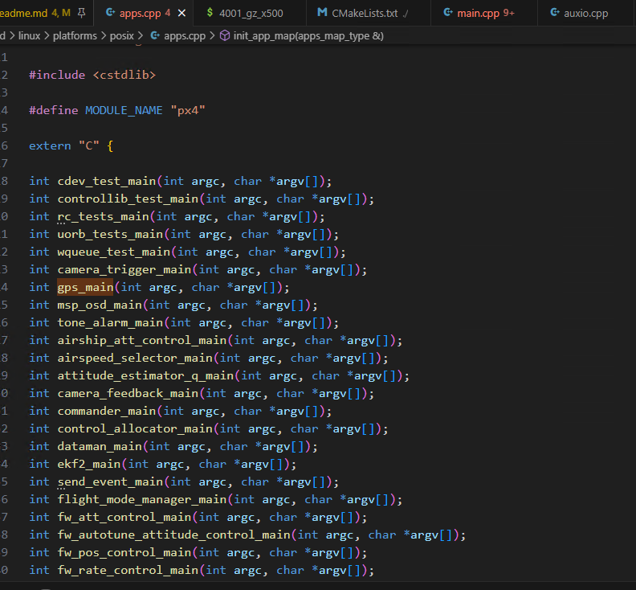
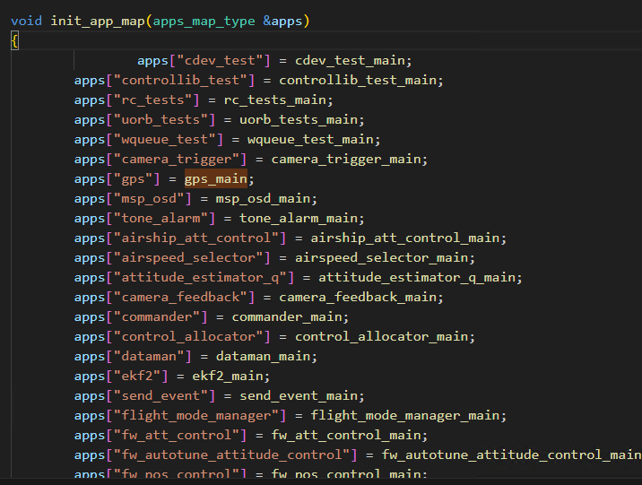

# 仿真环境搭建

ubuntu22.04
humble

##

bash ./PX4-Autopilot/Tools/setup/ubuntu.sh
cd PX4-Autopilot/
make px4_sitl

sudo apt install gpiod
make px4_sitl gz_x500

## test

pxh> commander takeoff

## ros2

pip install --user -U empy==3.3.4 pyros-genmsg setuptools==68.0.0

* setuptools

Setup the Agent

```bash

git clone https://github.com/eProsima/Micro-XRCE-DDS-Agent.git
cd Micro-XRCE-DDS-Agent
mkdir build
cd build
cmake ..
make
sudo make install
sudo ldconfig /usr/local/lib/

## start agent

MicroXRCEAgent udp4 -p 8888
```

### ros2 ws

```bash
mkdir -p ~/ws_sensor_combined/src/
cd ~/ws_sensor_combined/src/

git clone https://github.com/PX4/px4_msgs.git
git clone https://github.com/PX4/px4_ros_com.git

source /opt/ros/humble/setup.bash
colcon build

source install/local_setup.bash

ros2 launch px4_ros_com sensor_combined_listener.launch.py

ros2 run px4_ros_com offboard_control

```

## QGC

```bash

```


extern "C" __EXPORT int auxio_main(int argc, char *argv[])
{
	return G0AUX::main(argc, argv);
}

|
|

T::main(argc, argv) -> start_command_base(...) -> T::task_spawn(argc, argv);

build/linux/platforms/posix/apps.cpp






main() --> px4_daemon::Pxh::process_line(cmd, true); --> Pxh::process_line() --> init_app_map(_apps);


-------

cmake ../../ -DBOARD=px4_sitl

make -j4

https://docs.px4.io/v1.14/en/sim_gazebo_gz/
https://docs.px4.io/main/en/simulation/
https://docs.px4.io/main/zh/ros2/user_guide#install-px4
https://docs.px4.io/main/zh/ros2/user_guide
